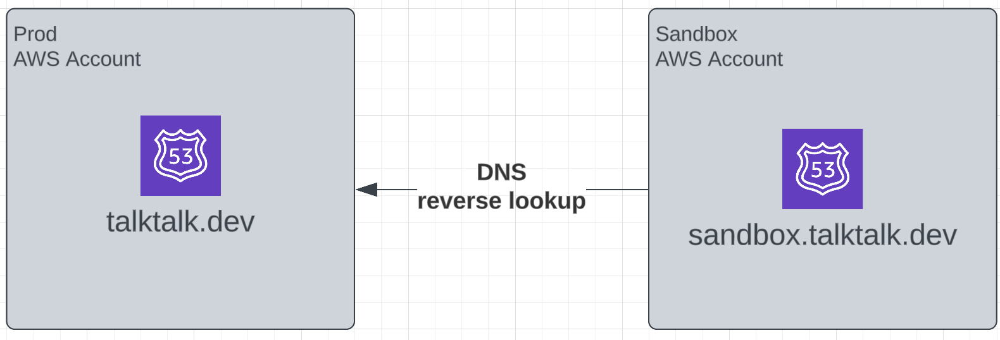

# Problem Statement

### Cross Account DNS

- Your cool messaging app `talktalk` is hosted at `talktalk.dev`

- You want to create a sandbox version of `talktalk` hosted at `sandbox.talktalk.dev` in another AWS Account

### _How to send DNS traffic to the sandbox subdomain in another AWS Account?_
